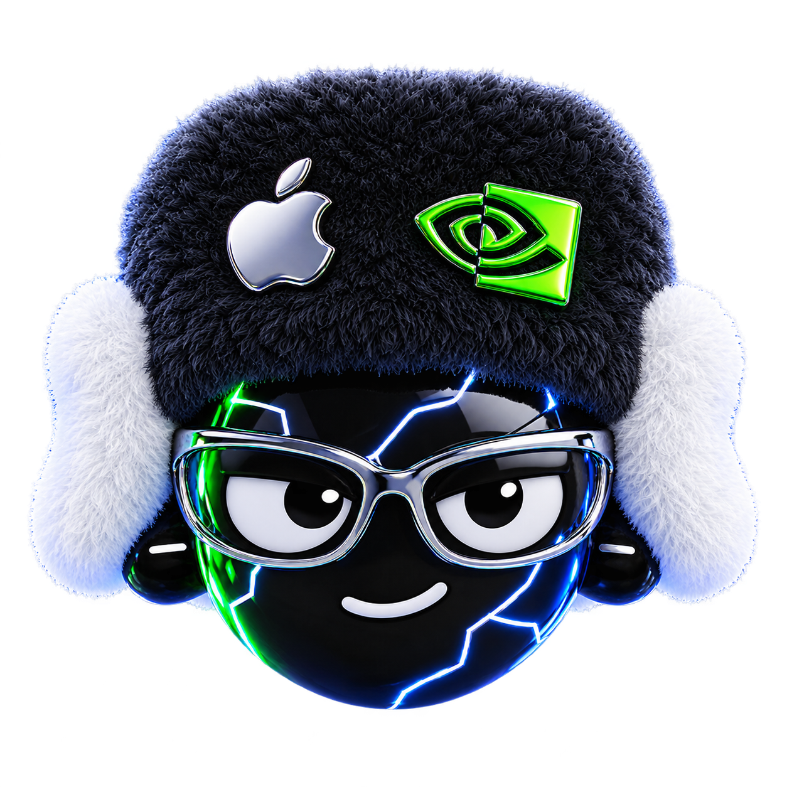
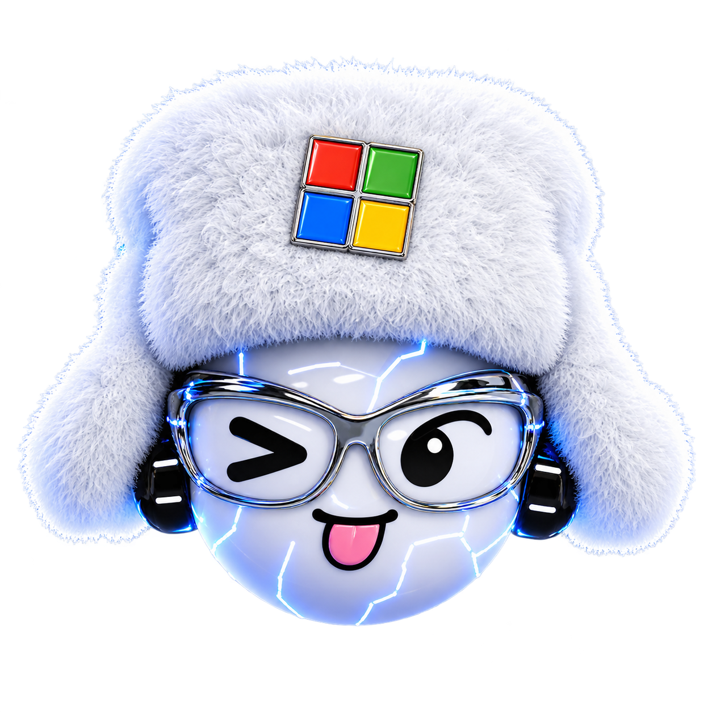
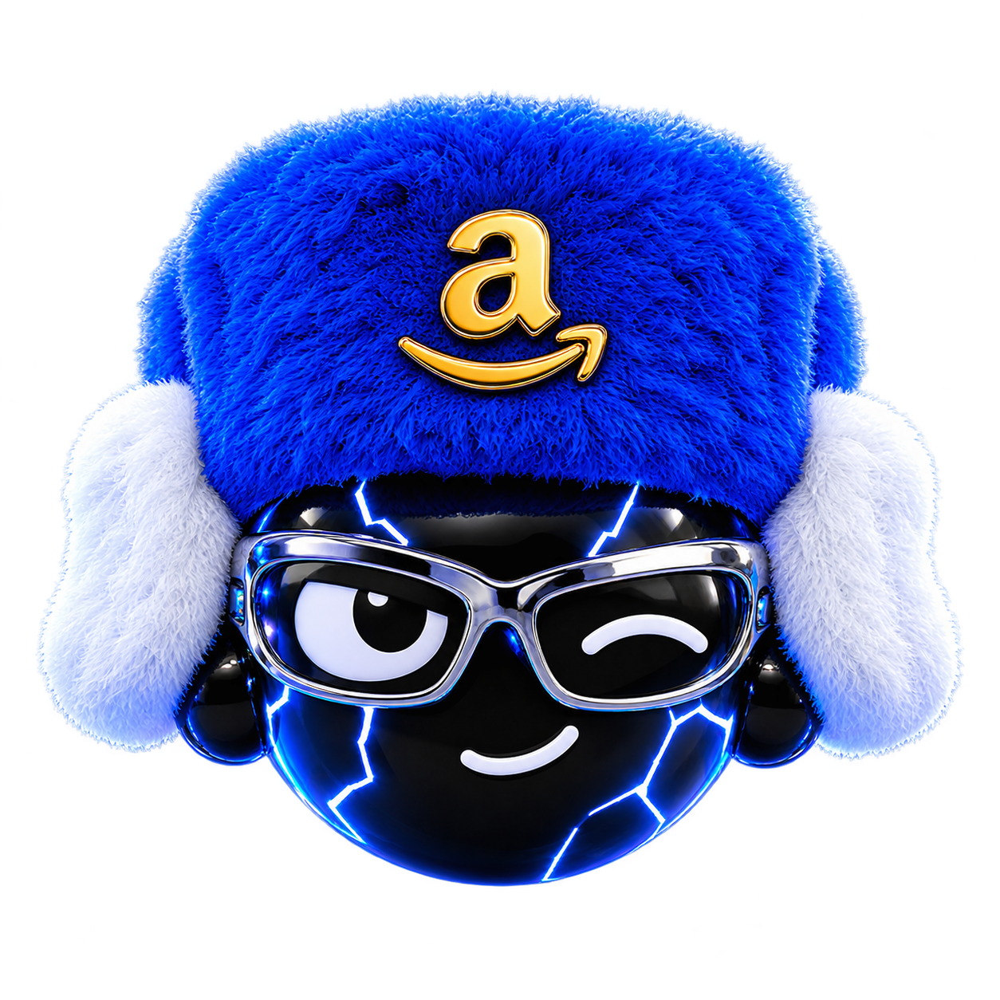
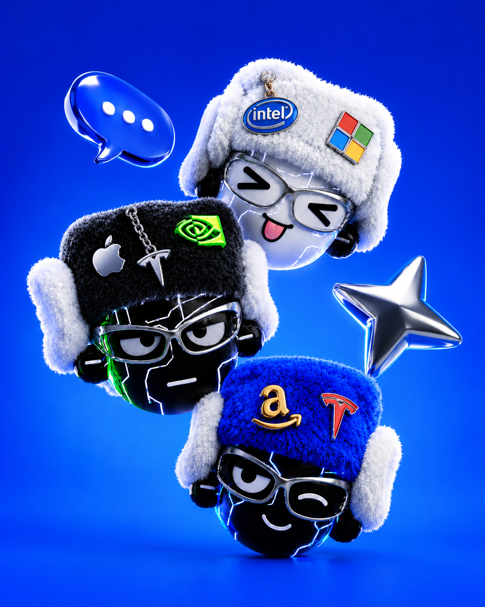

<div align="center">

# Daybreak

### Find your circle.

Discover companies, follow your interests, and give your watchlist a little personality.

**Built on Base · Next.js · TypeScript · Privy · Postgres**

[Get started](#get-started) · [Product](#the-product) · [Architecture](#architecture) · [Roadmap](#where-were-going)



</div>

## The product

Your interests are bigger than a ticker symbol. Gaming, AI, the brands you use every day: they connect companies, culture, and people.

Daybreak is building a discovery layer around those connections. Explore companies and their tokenized stocks on Base, read the stories behind them, save what catches your eye, and make the experience yours. The longer-term home for all of this is your **circle**: people with shared interests exchanging watchlists, memes, and discoveries.

Electric blue, liquid glass, and plush stock-pin characters give Daybreak its identity. The interface is playful; the financial data stays explicit about its source, coverage, and limitations.

<table>
<tr>
<td></td>
<td></td>
<td></td>
</tr>
<tr><td align="center">Follow your interests</td><td align="center">Build your watchlist</td><td align="center">Find your people</td></tr>
</table>

## What works today

- **Company discovery:** a reviewed registry of 13 tokenized stocks on Base, with company details and source links. This is a curated catalog, not every asset on Base.
- **Read-only holdings:** connect a supported wallet to inspect balances and oracle-based reference values. Partial reads and missing prices remain visible.
- **Company news:** attributed GDELT headlines link to their original publishers, with loading, retry, and failure states.
- **External purchase links:** exact-token Base links hand off to Uniswap. Daybreak does not submit trades.
- **Personal profiles:** six plush character looks, editable profiles, and saved companies.
- **Account foundation:** Google, Apple, passkey, and wallet login through Privy; server-verified identity and Postgres-backed profiles, bookmarks, and circle membership when configured.
- **Related token discovery:** a separate Dexscreener-backed experimental lookup. Meme tokens are clearly distinguished from company stock.
- **Stock liquidity:** live Aerodrome Slipstream pool context and connected-wallet LP discovery for AAPL, NVDA, GOOGL, and META. Daybreak prepares a Bankr LP prompt; Bankr owns the final wallet review and confirmation.

**Status:** active development. Anonymous discovery works without account credentials. The account data layer has local database validation; a complete hosted Privy-to-Postgres sign-in flow still needs deployment verification. Shared feeds and public watchlists are upcoming, and example community profiles are labeled.

## Get started

Use Node.js 22 LTS and npm.

```sh
git clone https://github.com/ronkenx9/daybreak.git
cd daybreak
npm ci
cp .env.example .env.local
npm run dev
```

Open [localhost:3000](http://localhost:3000). The app is at `/app`; your profile is at `/app/profile`.

You can start with an empty `.env.local`. Discovery uses a public Base RPC, news needs no API key, and personal saves stay on the device until the account backend is configured.

### Enable accounts and cross-device persistence

1. Create a Privy application. Configure allowed origins and the Google, Apple, passkey, and wallet login methods you intend to support.
2. Create a Postgres database. Supabase Postgres is supported; the client disables prepared statements for pooler compatibility.
3. Set these values in `.env.local` and your hosting environment:

| Variable | Purpose | Visibility |
| --- | --- | --- |
| `NEXT_PUBLIC_PRIVY_APP_ID` | Enables the Privy client | Public app identifier |
| `PRIVY_APP_SECRET` | Verifies access tokens on the server | Server only |
| `DATABASE_URL` | Account database connection | Server only |
| `BASE_RPC_URL` | Optional dedicated Base RPC | Server only |

4. Apply the committed migrations, then verify every Daybreak table and its RLS protection:

```sh
npm run db:preflight
npm run db:migrate
npm run db:verify
```

5. Restart the app. Sign in and use **Import this device** to explicitly import existing local saves.

Private API requests use verified Privy bearer tokens. The server derives the acting user from that token. Profile writes use version checks; bookmark and membership updates operate on individual records. Cross-device refresh happens on focus and at intervals, rather than through live push.

See [account milestone notes](docs/ACCOUNTS-MILESTONE-1.md) for validation details and remaining acceptance checks.
For the deployment sequence and authorization model, see [Supabase database setup](docs/SUPABASE-DATABASE.md).

## Architecture

```text
Next.js / React interface
  ├─ Company discovery, circles, holdings, profile
  ├─ Privy identity + wallet connection
  └─ React Query
       └─ Next.js API routes
            ├─ Base RPC → balances and oracle references
            ├─ GDELT → company headline links
            ├─ Dexscreener → related token discovery
            ├─ Aerodrome + GeckoTerminal → stock LP positions and pool activity
            └─ Verified Privy identity → Drizzle → Postgres
```

| Location | Responsibility |
| --- | --- |
| `app/` | Pages, styles, and API routes |
| `components/daybreak/` | Product interface, identity, account state, and artwork sections |
| `lib/base/` | Token registry, chain reads, valuation, and market integrations |
| `lib/account/` | Authentication verification and API client |
| `lib/db/` | Schema, database connection, and account operations |
| `drizzle/` | Versioned database migrations |
| `public/assets/` | Characters, posters, marks, and company icons |
| `scripts/` | Registry tooling and core regression checks |
| `docs/` | Product plans, implementation notes, and audits |

### Data integrity

Holdings valuation uses raw ERC-20 quantities and total-return oracle answers with bigint arithmetic. Scaled share quantities are shown separately. Reads validate token/feed metadata and oracle pause state at a consistent block. Missing prices produce a priced subtotal and coverage information, never an invented complete total.

Oracle values are reference values, not executable quotes. External purchase links do not establish available liquidity or eligibility. News providers can rate-limit or time out. Current caches and request limits are process-local; production deployment needs appropriate shared infrastructure.

Wallet connection is separate from Daybreak account identity. Signing in does not create a funded wallet, move assets, or publish holdings. Older room purchase flows are isolated simulations.

## Development

```sh
npm test             # Core regression checks
npm run type-check   # TypeScript validation
npm run build        # Production build
npm run start        # Serve the production build
```

Run development and production builds from separate checkouts if they must run simultaneously: both use `.next` in this checkout.

## Where we're going

- Broader-interest circles with shared discoveries and conversation.
- Public and private watchlists with clear Save, Follow, and Copy behavior.
- Memes, company news, and stocks discovered through your circle.
- Independently customizable headwear and stock pins, beyond the six complete looks available today.
- Hosted account verification, account lifecycle controls, and stronger production infrastructure.

[Product roadmap](docs/FUTURE-PLANS.md) · [Account architecture](docs/ACCOUNT-AND-LOGIN-PLAN.md) · [Character assets](docs/CHARACTER-ASSETS.md) · [Core audit and fixes](docs/audit/DAYBREAK-FIXES-2026-09-06.md)

## Credits and rights

Daybreak's character and poster artwork was generated for this project from the owner's visual direction. Company names and logos identify their respective companies and do not imply endorsement. DynaPuff's font license is included in `public/fonts/DynaPuff-OFL.txt`.

This repository is public for review and collaboration. No general open-source license has been granted yet.
