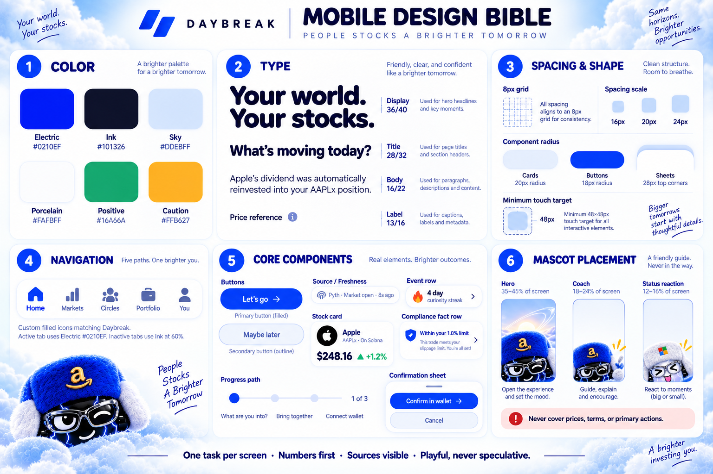
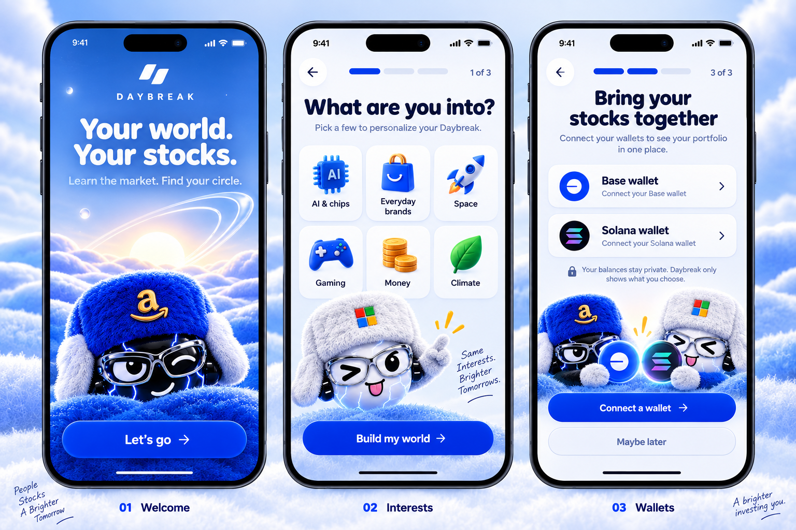
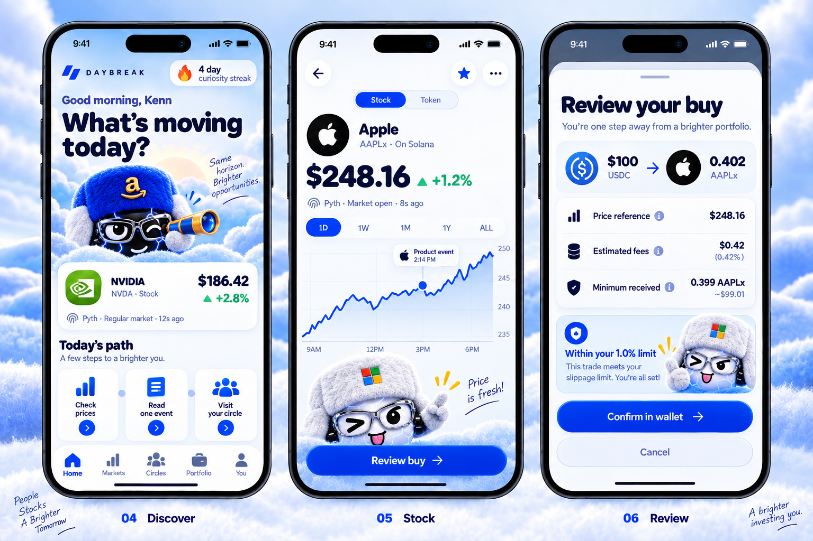
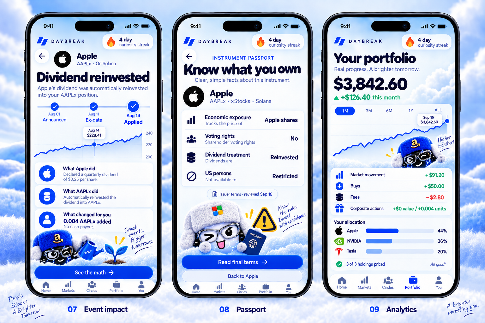
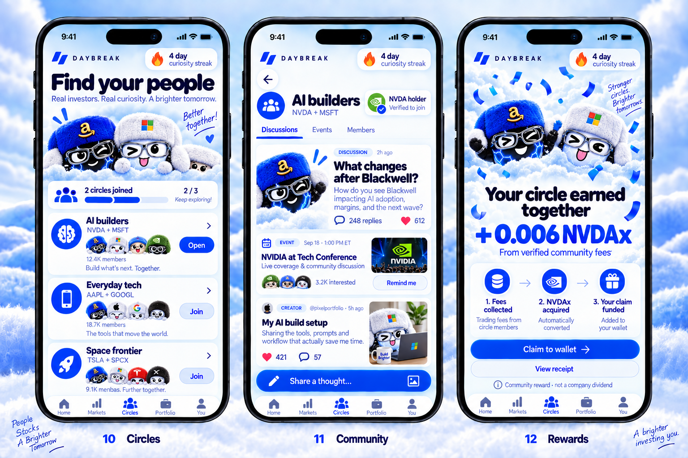
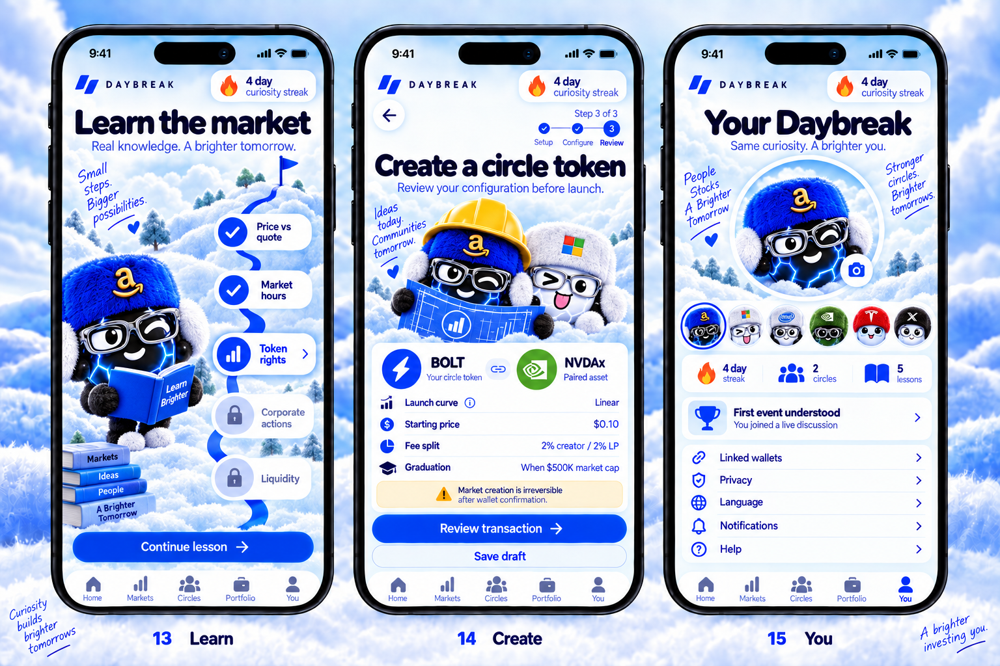
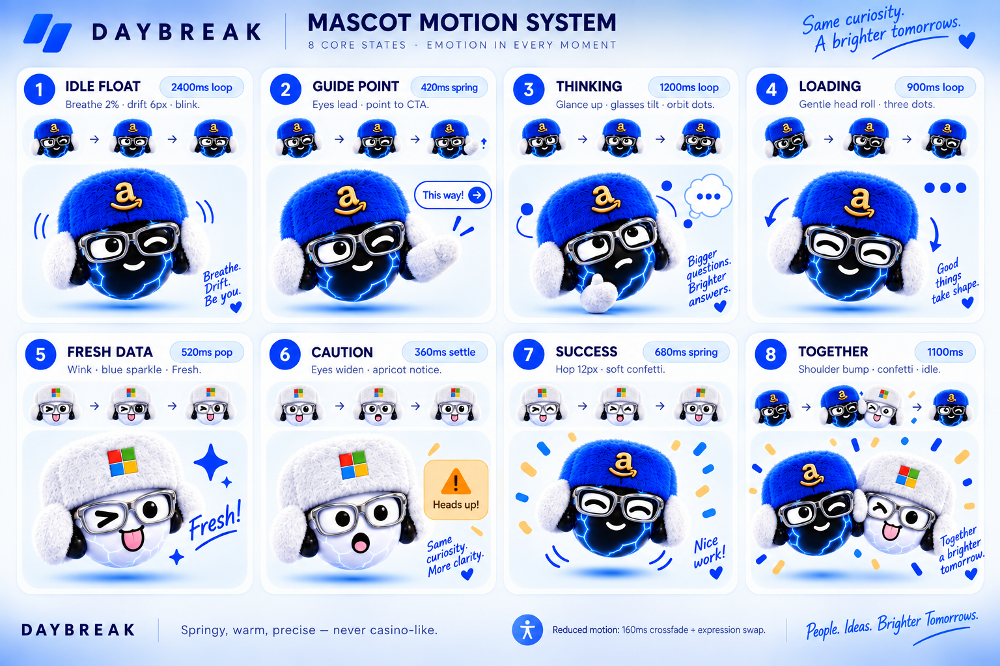

# Daybreak mobile build plan

**Status:** approved visual direction and implementation guide  
**Product:** Daybreak mobile web app / installable PWA  
**Direction:** playful stock education, trustworthy market context, verified communities  
**Reference behavior:** Duolingo-style short paths, progress, mascot coaching, and celebrations—expressed through Daybreak's own visual identity.

This document is the builder-facing source of truth for the mobile experience. It combines the screen mockups, navigation, mascot motion, component system, data rules, implementation order, and completion checks.

The numbers and balances shown in the concept images are illustrative. Production prices, balances, events, rights, fees, eligibility, and rewards must come from verified sources.

## Product promise

Daybreak helps people understand tokenized stocks, see what they own across supported chains, learn how real events affect their instruments, and meet communities built around shared interests.

The primary loop is:

> Learn a market concept → inspect a stock → understand the instrument → take an informed action → return to the relevant circle.

Community creation and rewards extend this loop. They should never obscure the four foundations:

1. Price context and freshness.
2. Corporate actions and their actual token effects.
3. Instrument rights and restrictions.
4. Honest personal analytics.

## Mobile design system

### Platform and layout

- Cross-platform premium neutral, optimized first for a 390 × 844 viewport.
- Respect top safe areas, bottom gesture space, and keyboard/sheet behavior.
- Use one primary task per screen and one visually dominant action.
- Use an 8px layout grid with 16px, 20px, and 24px common spacing.
- Minimum interactive target: 48 × 48px.
- Cards: 20px radius. Primary buttons: 18px radius. Bottom sheets: 28px top radius.
- Avoid nested card stacks. Prefer a clear page surface, one focal module, and supporting rows.

### Palette

| Token | Value | Use |
| --- | --- | --- |
| Electric | `#0210EF` | Primary actions, selected states, core brand moments |
| Ink | `#101326` | Headlines and high-emphasis content |
| Sky | `#DDEBFF` | Informational surfaces and calm backgrounds |
| Porcelain | `#FAFBFF` | Main app background |
| Positive | `#16A66A` | Confirmed positive movement and successful states |
| Caution | `#FFB627` | Warnings, pending actions, and attention states |

Red is reserved for destructive or negative financial values. Never use color as the only status signal.

### Typography

- Display: friendly rounded face, 36/40 for hero statements.
- Title: rounded or bold product face, 28/32.
- Body: clean product sans, 16/22.
- Label: 13/16 minimum, used sparingly for sources and metadata.
- Financial numbers use tabular figures where available.
- Copy stays short. Split dense explanations into progressive screens or sheets.

### Navigation

Use five persistent destinations:

1. **Home** — daily path, personalized discovery, learning prompts.
2. **Markets** — stock search, lists, asset detail, trade entry.
3. **Circles** — circle discovery, discussions, events, members.
4. **Portfolio** — cross-chain holdings, actions, performance, coverage.
5. **You** — avatar, streak, linked wallets, privacy, language, notifications.

Creation is contextual from a circle or profile action. It is not a sixth permanent tab.

## Flow 1 — onboarding

### 01 Welcome

**Purpose:** establish the Daybreak world and one clear next step.

- Headline: “Your world. Your stocks.”
- Show one mascot hero inside the plush Daybreak landscape.
- Primary action: “Let's go.”
- No market numbers, permissions, or promotional clutter.

**Complete when:** the primary action advances immediately and remains reachable on the smallest supported viewport.

### 02 Interests

**Purpose:** personalize discovery without requiring financial disclosure.

- Six large selections: AI & chips, Everyday brands, Space, Gaming, Money, Climate.
- Allow multiple selections and a clear selected state.
- Preserve progress across authentication or wallet steps.
- Interests rank discovery; they do not become investment recommendations.

**Complete when:** selection state is keyboard/touch accessible, persisted, editable later, and reflected in Home ordering.

### 03 Wallets

**Purpose:** connect Base and Solana ownership to one Daybreak account.

- Show Base wallet and Solana wallet as separate connection rows.
- Explain that balances stay private and only chosen information is shared.
- Allow “Maybe later” without blocking learning or market browsing.
- Each chain has its own signed ownership challenge and address validation.
- Never lowercase Solana addresses or reuse EVM address rules.

**Complete when:** a user can link either chain, see the exact connected address, unlink it, and understand what Daybreak stores.

## Flow 2 — discovery and informed trading

### 04 Discover

**Purpose:** give the user a small, useful daily path instead of an endless dashboard.

- Personalized market focus card with current price context.
- Three-step daily path: check prices, read one event, visit a circle.
- Curiosity streak rewards learning and exploration, not trading frequency or money spent.
- Show source, market session, and age alongside every highlighted price.

**Complete when:** the path responds to real completion events and never awards a trading streak for financial activity.

### 05 Stock detail

**Purpose:** explain one company and one exact tokenized instrument.

- Keep **Stock** and **Token** views distinct.
- Header includes company, issuer token, chain, current reference, percentage movement, source, session, and timestamp.
- Chart event markers open the corresponding event-impact screen.
- A “Price is fresh” mascot reaction appears only when the declared freshness policy passes.
- Primary action opens trade review. It does not submit a transaction.

**Complete when:** closed-market, stale, carried-forward, unavailable, and current states are visually distinct and accessible.

### 06 Trade review

**Purpose:** let the user understand exactly what will happen before wallet confirmation.

- Show input, estimated output, price reference, total fees, minimum received, route, wallet, chain, and expiry.
- Changing amount, asset, wallet, or chain invalidates the quote.
- The positive mascot state confirms that declared limits pass; it never promises profit.
- Confirmation opens the actual wallet approval surface.

**Complete when:** the reviewed intent is cryptographically and server-side bound to the submitted transaction, and ambiguous submissions reconcile without double execution.

## Flow 3 — events, product facts, and analytics

### 07 Event impact

**Purpose:** connect a sourced company event to its actual token treatment and the user's position.

Always present three separate sections:

1. **What the company did** — sourced event facts and dates.
2. **What the token did** — the issuer's confirmed treatment and effective time.
3. **What changed for you** — deterministic position effect.

News can provide context, but a headline is not proof of a corporate action or its effect. Do not claim that an article caused a price movement.

**Complete when:** dividend, split, reverse-split, correction, duplicate, and missing-treatment fixtures resolve honestly. Mechanical quantity changes never create fictional profit.

### 08 Instrument passport

**Purpose:** explain what the user owns without a wall of legal text.

Each exact instrument shows:

- Issuer and chain.
- Legal product type.
- Economic exposure.
- Voting rights.
- Dividend or distribution treatment.
- Backing/custody source.
- Purchase, transfer, and redemption conditions.
- Jurisdiction or route restrictions.
- Source documents and last review date.

Do not infer action eligibility from a connected wallet, successful quote, or IP location alone. “Unknown,” “restricted,” and “available through this route” are separate states.

**Complete when:** two instruments referencing the same company can display different terms without being merged by ticker.

### 09 Portfolio analytics

**Purpose:** help the user understand changes in their portfolio without inventing cost basis or performance.

- Current reference value with priced/unpriced coverage.
- Reference-value history.
- Attribution: market movement, buys, sells, fees, transfers, and corporate actions.
- Company, issuer, chain, and asset allocation.
- Cost basis and realized/unrealized return only where history is sufficient.
- Incoming transfers with unknown acquisition history remain “cost basis unknown.”

**Complete when:** buys, sells, fees, transfers, splits, duplicates, and missing history reconcile independently and cross-user data isolation passes.

## Flow 4 — circles and transparent rewards

### 10 Circles

**Purpose:** find communities through interests and verified stock relationships.

- Recommend circles from selected interests and eligible holdings.
- Clearly distinguish open circles from verified-holder circles.
- Membership does not reveal balances or position size.
- Member counts and faces come from real opted-in users only.

**Complete when:** empty states remain useful and no sample users or fabricated activity appear in production.

### 11 Community

**Purpose:** make one circle feel alive through focused discussions, events, news, and creations.

- Tabs: Discussions, Events, Members.
- One featured prompt can use the mascot as host.
- Company news opens inside a discussion workspace with source attribution.
- The composer is prominent but never hides verification or moderation state.

**Complete when:** access policy is rechecked for gated content and private holdings never enter public payloads.

### 12 Rewards

**Purpose:** explain a funded community reward from source to claim.

- Show the exact reward asset and amount.
- Show the receipt path: fees collected → stock token acquired or retained → claim funded.
- Label it “Community reward · not a company dividend.”
- Celebration follows verified funding. It cannot appear for simulated or pending rewards.

**Complete when:** one genuine receipt reconciles through allocation and claim, including fees, rounding, dust, retries, and zero-revenue behavior.

## Flow 5 — learn, create, and profile

### 13 Learn

**Purpose:** turn difficult market concepts into short, calm lessons.

Initial path:

1. Price vs quote.
2. Market hours.
3. Token rights.
4. Corporate actions.
5. Liquidity.

Lessons end with a comprehension check or a real product action such as opening an instrument passport. Progress measures understanding, not capital deployed.

**Complete when:** progress is persistent, reduced-motion friendly, and available without a wallet.

### 14 Create

**Purpose:** review a stock-paired community-token configuration before signing.

- Show the community token and exact paired stock instrument.
- Show curve, starting price, fee split, graduation rule, creator wallet, and irreversible-action notice.
- Save drafts before invoking providers.
- Separate simulation, wallet confirmation, submitted, confirmed, failed, and unknown states.
- Generated examples must not imply expected returns.

**Complete when:** the review fingerprint matches the submitted configuration and uncertain responses cannot create duplicate launches.

### 15 You

**Purpose:** make identity, progress, wallets, and privacy easy to manage.

- Large customizable Daybreak mascot.
- Curiosity streak, circles, lessons, and earned learning achievements.
- Linked wallets, Privacy, Language, Notifications, and Help.
- Wallets display chain and shortened address; removing one requires a clear account-level action.

**Complete when:** avatar selection, language, notifications, linked-wallet state, and deletion/privacy controls persist correctly.

## Mascot motion system

| State | Timing | Use |
| --- | --- | --- |
| Idle float | 2400ms loop | Quiet presence in hero or empty states |
| Guide point | 420ms spring | Direct attention to the next safe action |
| Thinking | 1200ms loop | Waiting for a user choice or explanation |
| Loading | 900ms loop | Bounded network work; never imply completion |
| Fresh data | 520ms pop | A verified freshness policy just passed |
| Caution | 360ms settle | Terms, stale data, unavailable routes, or irreversible actions |
| Success | 680ms spring | Confirmed non-financial progress or verified completion |
| Together | 1100ms | Community milestones and funded shared outcomes |

### Motion rules

- Motion character: springy, warm, and precise.
- Never use slot-machine movement, constant bouncing, pulsing prices, or confetti around speculative gains.
- Mascots never cover prices, terms, warnings, or primary actions.
- Loading animation stops on timeout and becomes a clear retry/error state.
- Celebration occurs once per confirmed event and does not replay on every render.
- Reduced motion: 160ms crossfade plus expression swap; remove parallax, hop, drift, and confetti travel.
- Pause loops when offscreen or when the document is hidden.

## Component inventory

Build shared mobile primitives before individual screens:

- App shell and five-tab navigation.
- Mascot stage with size, emotion, motion, and reduced-motion variants.
- Primary/secondary/destructive buttons.
- Source and freshness row.
- Stock identity header.
- Price and coverage display.
- Chart with event markers.
- Event timeline and impact sections.
- Instrument fact row and policy status.
- Portfolio attribution row and allocation bar.
- Lesson path and progress node.
- Circle card, feed card, verified access badge, and composer.
- Quote/review sheet and durable operation status.
- Reward receipt timeline.
- Wallet connection row and privacy disclosure.
- Loading, empty, unavailable, partial, stale, restricted, failed, and unknown states.

Use existing Daybreak mascot PNGs from `public/assets/characters/` and stock identifiers from `public/assets/stock/`. Prepare optimized mobile derivatives rather than scaling full-resolution files on every screen.

## Data and truth requirements

### Prices

- Every price carries instrument identity, source, basis, timestamp, receipt time, market session, and confidence/status where available.
- A fresh transport timestamp cannot make an old underlying value current.
- Reference prices and executable quotes remain separate.
- Closed-market comparisons are labeled as such.

### Corporate actions

- Store company event, issuer treatment, and personal effect separately.
- Preserve revisions and corrections.
- Use historical multipliers for historical quantities.
- Never apply a Solana xStocks treatment to a Coinbase Base instrument by analogy.

### Compliance information

- Policy is specific to instrument, route, action, jurisdiction conditions, source version, and review date.
- Holding ability does not prove purchase or redemption eligibility.
- Daybreak explains sourced facts; it does not label a person legally “compliant.”

### Analytics

- Use integer or exact-decimal monetary math.
- Never treat wallet deposits as profit.
- Never produce complete P&L with incomplete acquisition history.
- Always show coverage, stale values, and unknown basis.

## Route and code map

Use the existing Next.js application and adapt routes to the final information architecture.

| Mobile destination | Current or proposed surface |
| --- | --- |
| Home / Discover | `/app`, `components/daybreak/DaybreakApp.tsx` |
| Markets | Existing discovery modules; add a dedicated mobile route if needed |
| Stock detail | Existing detail dialog/components; promote to shareable route or full-screen mobile stack |
| Trade review | `components/daybreak/TradeSheet.tsx` |
| Portfolio | Existing holdings route and `Portfolio.tsx` |
| Circles | `/app/groups`, `CirclesHub.tsx` |
| Community | Existing circle detail and discussion modules |
| Learn | Proposed `/app/learn` and reusable lesson path components |
| Create | `/app/launch`, `LaunchPortal.tsx`, `StonkFunLaunch.tsx` where qualified |
| You | `/app/profile`, account and photo components |
| Prices | `lib/base/prices.ts`; add shared instrument model and Pyth adapter |
| Holdings | `lib/base/holdings.ts`; add chain-aware Solana adapter |
| Corporate actions | Proposed provider ingestion and event-impact modules |
| Policy facts | Proposed versioned instrument-policy modules |
| Analytics | Proposed private ledger and attribution modules |

Do not enlarge `DaybreakApp.tsx` into a mobile monolith. Extract route-level screens and shared primitives.

## Build sequence

### Phase 0 — mobile shell and tokens

- Implement design tokens, typography, app shell, safe areas, five-tab navigation, buttons, sheets, and mascot stage.
- Add responsive mobile routes while preserving current desktop behavior.
- Verify 390 × 844, 375 × 812, and 430 × 932 viewports.

### Phase 1 — onboarding and identity

- Build Welcome, Interests, Wallets, and You.
- Reuse existing Privy account model and add explicit Solana ownership binding.
- Finish privacy copy, persistence, relinking, and error states.

### Phase 2 — market foundation

- Build Discover, Stock detail, and the learning path.
- Integrate session-aware price context and source/freshness presentation.
- Add cached, clearly labeled demo resilience without using snapshots for live execution decisions.

### Phase 3 — event impact and instrument passport

- Add corporate-action ingestion, revision history, token-treatment verification, and position impact.
- Add versioned issuer facts and route-specific policy status.
- Add event markers to charts and discussions.

### Phase 4 — portfolio analytics

- Implement opted-in portfolio history and idempotent transaction ledger.
- Add truthful reference value, allocation, attribution, and incomplete-history handling.
- Preserve binary holder-circle eligibility separately from private analytics.

### Phase 5 — circles and community

- Apply the new Circles and Community screens to existing real data.
- Remove remaining sample social data.
- Link market events and lessons into relevant discussions.

### Phase 6 — actions

- Finish wallet-bound stock trade review and receipt reconciliation.
- Finish creator launch review and durable operation recovery.
- Add community reward receipt and claim only after genuine fee flow is available.

### Phase 7 — motion and polish

- Add the eight mascot states, reduced motion, haptics where supported, offline/error recovery, and loading budgets.
- Perform visual comparisons against all five flow boards and the design bible.

## Required states for every data-backed screen

Each feature must define:

- Initial loading.
- Refreshing with previous data.
- Empty.
- Partial coverage.
- Provider unavailable.
- Stale or carried-forward.
- Restricted or unsupported.
- Success.
- Failure.
- Unknown pending state for potentially submitted operations.

Unknown is never rendered as zero, success, or absence.

## Accessibility and mobile quality

- Maintain WCAG AA contrast for text and essential controls.
- All touch targets are at least 48px.
- Support Dynamic Type or browser text scaling without clipping primary actions.
- Every icon has a text label or accessible name.
- Mascot imagery is decorative when adjacent copy conveys the same meaning.
- Charts have textual summaries and event lists.
- Focus is trapped and restored correctly in sheets and dialogs.
- Announce quote expiry, wallet result, errors, and reward confirmation to assistive technology.
- Respect reduced motion, data saver, and background-tab throttling.

## Verification checklist

### Visual

- Compare every completed screen with its numbered mockup at the three target viewport sizes.
- Confirm nav, type hierarchy, mascot scale, spacing, button position, and safe areas.
- Confirm the product still feels like Daybreak when mascot art is temporarily absent.

### Product correctness

- Price sources and timestamps are real and labeled.
- Corporate-action numbers come from deterministic computation.
- Instrument facts link to exact current sources.
- Analytics show coverage and unknown basis.
- Gated circles disclose no private balance.
- Celebration appears only after confirmed outcomes.

### Engineering

- `npm test`
- `npm run type-check`
- `npm run build`
- Database preflight and RLS verification for new private tables.
- Mobile browser walkthrough on all three viewport targets.
- Real-network read proof for at least one qualified Base instrument and one qualified Solana xStock.
- Separately authorized real transaction proof before claiming live trading, launching, or claims.

## Definition of done

The mobile build is complete when a new user can:

1. Choose interests and optionally connect Base or Solana.
2. Open a supported stock and understand the price's source, session, and freshness.
3. Understand a corporate action at company, token, and personal-position levels.
4. Read the exact instrument's rights and conditions.
5. See honest portfolio analytics with coverage.
6. Complete a short learning path.
7. Join an eligible circle without exposing their balance.
8. Review any financial action before wallet confirmation.
9. Recover from stale data, provider failures, and unknown transaction states.
10. Experience mascot guidance and celebrations with full reduced-motion support.

The design is not complete if only the happy-path screens resemble the mockups. Loading, partial, stale, unavailable, restricted, failure, and recovery states must feel equally intentional.

